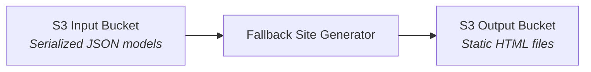
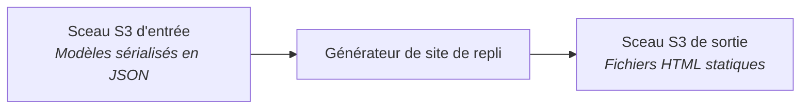

# English

## Purpose

This project allows for the rapid and automated deployment of a static site. Serves as a demo/sample for the OPBO public API and could be used as part of the business continuity plan deployment.

## Running the script locally

1. Create a .env file (`cp .env.sample .env`) and provide the required input and output bucket names and credentials.
2. Run `php run.php`.

## Core concept

All public content on the OPBO website is stored in an S3 bucket in a JSON serialized form. The generator reads all of these files to generate a static website, consisting of a series of HTML files stored in an output S3 bucket.

# Français

## Objectif

Ce projet permet le déploiement rapide et automatisé d'un site statique. Il sert de démo/échantillon pour l'API publique du BDPB et pourrait être utilisé dans le cadre du déploiement du plan de continuité des activités.

## Lancer le script localement

1. Créez un fichier .env (`cp .env.sample .env`) et fournissez les noms des bucket d'entrée et de sortie requis ainsi que les informations d'identification.
2. Exécutez `php run.php`.

## Concept de base

Tout le contenu public du site web de l'OPBO est stocké dans un seau (bucket) S3 sous une forme sérialisée en JSON. Le générateur lit tous ces fichiers pour générer un site web statique, composé d'une série de fichiers HTML enregistrés dans un autre sceau S3 de sortie.

